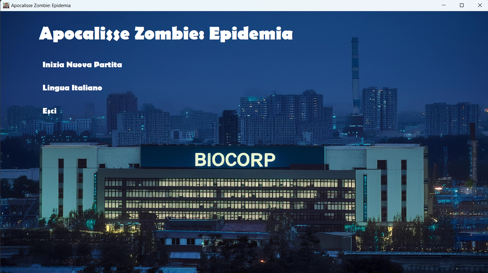
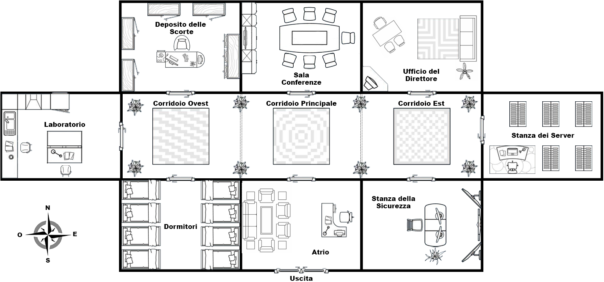
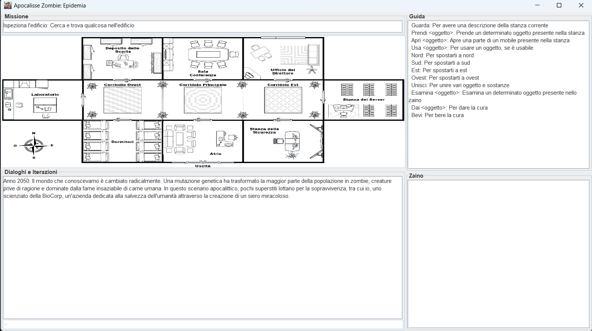
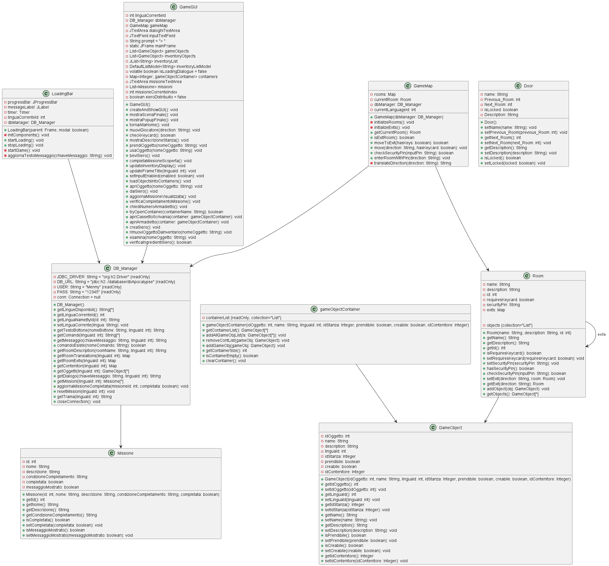

# Apocalisse Zombie: Epidemia - Report
 - [1. Introduzione ](#1-introduzione)

- [2. Caratteristiche del progetto](#2-caratteristiche-del-progetto)
    - [2.1 Trama del gioco](#21-trama-del-gioco)
    - [2.2 Caratteristiche funzionali del gioco](#22-caratteristiche-funzionali-del-gioco)
 - [3. Walkthrough](#3-walkthrough)
 - [4. OOP](#4-oop)
    - [4.1. Diagramma delle classi](#41-diagramma-delle-classi)
    - [4.2. Specifiche algebriche](#42-specifiche-algebriche)
 - [5. File](#5-file)
 - [6. Database](#6-database)
 - [7. Thread](#7-thread)
 - [8. SOCKET o REST](#8-socket-o-rest)
 - [9. SWING](#9-swing)
 - [10. Lambda expressions o functions](#10-lambda-expressions-o-functions)


### Team

Il team che ha lavorato sul progetto è composto da:
- Antonio Mennea     
- Vincenzo Sarcina
- Mattia Stella
## 1. Introduzione 
Il gioco realizzato è stato progettato in occasione dell'esame Metodi Avanzati di Programmazione sotto la guida del professore Pierpaolo Basile. Il titolo del gioco è Apocalisse Zombie: Epidemia. Il progetto realizzato riguarda l'avventura testuale di un gioco. Le avventure testuali sono dei programmi che simulano un ambiente nel quale i giocatori usano comandi testuali per istruire il personaggio della storia a interagire con l'ambiente circostante.
## 2. Caratteristiche del progetto
### 2.1. Trama del gioco
Anno 2050. Il mondo che conoscevamo è cambiato radicalmente. Una mutazione genetica ha trasformato la maggior parte della popolazione in zombie, creature prive di ragione e dominate dalla fame insaziabile di carne umana. In questo scenario apocalittico, pochi superstiti lottano per la sopravvivenza, tra cui io, uno scienziato della BioCorp, un'azienda apparentemente dedicata alla salvezza dell'umanità attraverso la creazione di un siero miracoloso. Tuttavia, la verità che ho scoperto è ben più oscura: BioCorp è la causa di questa catastrofe e non ha alcun interesse a salvare le persone.







### 2.2. Caratteristiche funzionali del gioco

Per poter cominciare una nuova esperienza di gioco ci sono dei comandi da eseguire per sfruttare al meglio tutte le funzionalità del gioco

**Comandi:**

- **Guarda:** Per avere una descrizione della stanza corrente
- **Prendi oggetto:** Prende un determinato oggetto
- **Apri oggetto:** Apre un determinato oggetto
- **Usa oggetto:** Usa un determinato oggetto
- **Nord:** Per spostarti a nord
- **Sud:** Per spostarti a sud
- **Est:** Per spostarti a est
- **Ovest:** Per spostarti a ovest
- **Unisci:** Per utilizzare l'oggetto, se utilizzabile
- **Esamina oggetto:** Esamina un determinato oggetto
-  **Dai oggetto:** Per dare la cura
-  **Bevi oggetto:** Per bere la cura


## 3. Walkthrough
-  **Gameplay del gioco:** https://youtu.be/p2kPyZwm16g 


## 4. OOP

### 4.1. Diagramma delle classi



### Descrizione Complessiva

#### **LoadingBar**
La classe `LoadingBar` gestisce la barra di caricamento del gioco. Include attributi come `progressBar`, `messaggioLabel`, `timer`, `finestra`, e `manager` che rappresentano rispettivamente la barra di progresso, l'etichetta per i messaggi, il timer, la finestra principale e il gestore del database. I metodi principali sono `LoadingBar(DB_Manager)`, che è il costruttore, `main(String[])`, che avvia il caricamento, e `aggiungiTaskMessaggio(String, boolean)` che aggiunge messaggi alla barra di progresso.

#### **GameGUI**
La classe `GameGUI` è il cuore dell'interfaccia utente del gioco. Gestisce vari componenti della GUI come `IntInputContent`, `OK_Manager`, `GameMap`, `LoadingBar` e altri. I suoi metodi principali includono `caricaGameMap()`, che carica la mappa del gioco, `caricaOggettiDiGioco()`, che carica gli oggetti di gioco, `avviaGioco()`, che avvia il gioco, e `salvaGioco()`, che salva lo stato attuale del gioco.

#### **GameMap**
La classe `GameMap` gestisce la mappa del gioco. Contiene una mappa di stanze (`stanze`), un gestore del database (`mappaManager`), e un contenitore di oggetti di gioco (`gameObjectContainer`). I metodi principali sono `creaMappa()`, che crea una nuova mappa di gioco, `modificaStanza()`, che modifica una stanza esistente, `ottieniStanzaPerNome()`, che ottiene una stanza specifica per nome, e `rimuoviStanza()`, che rimuove una stanza dalla mappa.

#### **Room**
La classe `Room` rappresenta le stanze del gioco. Ha attributi come `name`, `description`, `isEntry`, `isExit`, `neighbors`, e `gameObjectContainer` che descrivono il nome della stanza, la descrizione, se è un'entrata o un'uscita, i vicini e il contenitore degli oggetti di gioco. I metodi principali includono `addOggetto()`, che aggiunge un oggetto alla stanza, `rimuoviOggetto()`, che rimuove un oggetto, `ottieniOggettoPerNome()`, che ottiene un oggetto per nome, e `entraStanza()`, che permette di entrare nella stanza.

#### **Door**
La classe `Door` rappresenta le porte tra le stanze. I suoi attributi includono `name`, `isOpen`, `isLocked`, `description`, `room1`, e `room2`, che descrivono il nome della porta, se è aperta o chiusa, se è bloccata o no, la descrizione e le stanze che collega. I metodi principali sono `setApertura()`, che imposta lo stato di apertura, `setBlocco()`, che imposta lo stato di blocco, e `entraPorta()`, che permette di attraversare la porta.

#### **DB_Manager**
La classe `DB_Manager` gestisce la connessione al database. Include attributi per la configurazione del database come `DB_DRIVER`, `DB_URL`, `USER`, e `PASS`. I suoi metodi principali sono `connetti()`, che connette al database, `disconnetti()`, che disconnette dal database, `eseguiQuery()`, che esegue una query, e `ottieniResultSet()`, che ottiene un result set dal database.

#### **Mission**
La classe `Mission` gestisce le missioni del gioco. I suoi attributi includono `id`, `description`, e `isCompleted` che rappresentano l'identificativo della missione, la descrizione e se la missione è completata. I metodi principali sono `ottieniMissione()`, che ottiene una missione specifica, `completaMissione()`, che completa una missione, e `aggiornaStatoMissione()`, che aggiorna lo stato della missione.

#### **GameObjectContainer**
La classe `GameObjectContainer` gestisce un contenitore di oggetti di gioco. Il suo attributo principale è `containerList`, che è una lista di oggetti di gioco. I metodi principali sono `aggiungiOggetto()`, che aggiunge un oggetto al contenitore, `rimuoviOggetto()`, che rimuove un oggetto, e `ottieniOggettoPerNome()`, che ottiene un oggetto per nome.

#### **GameObject**
La classe `GameObject` rappresenta gli oggetti di gioco. I suoi attributi includono `id`, `name`, `description`, `isMovable`, `isPickable`, e altri che descrivono l'identificativo, il nome, la descrizione, se l'oggetto è mobile o raccoglibile. I metodi principali includono `esaminaOggetto()`, che esamina un oggetto, `usaOggetto()`, che usa un oggetto, e `spostaOggetto()`, che sposta un oggetto.


## 4.2. Specifiche algebriche

### Specifiche Sintattiche
### Tipi e Operatori

| Tipi |
|-----------|
| List, Item, Integer, Boolean  |

| Operatore | Descrizione |
|-----------|-------------|
| newList() -> List | Crea una nuova lista vuota |
| add(List, Item, Integer) -> List | Aggiunge un elemento alla lista |
| getItem(List, Integer) -> Item                   | Restituisce l'elemento specificato| 
| size(List) -> Integer   | Restituisce l'ultima posizione occupata da un elemento |
| remove(List, Integer) -> List  | Rimuove dalla lista l'elemento nella posizione specificata |
### Osservazioni e Costruttori

|   Osservazioni    |    newList        |       add(l, it, id)          | 
|-----------|-------------|-------------|
| size(l')                 |      error        | if isEmpty(l) then 1 else getLastIndex(l) + 1  |
| getIndex(l', it')        |      error        | if it = it' then id else getIndex(l, it')      |
| getItem(l', id')         |      error        | if id = id' then it else getItem(l, id')       |
| remove(l', id')          |      error        | if id = id' then l else add(remove(l, id'), it)|
## Specifiche Semantiche 
### DECLARE
```
- l, l'   : List
- it, it' : Item
- id, id' : Integer
```
```
- getIndex(add(l, it, id), it')         = if it = it' then id else getIndex(l, it')
- getItem(add(l, it, id), id')          = if id = id' then it else getItem(l, id')
- remove(add(l, it, id), id')           = if id = id' then l else add(remove(l, id'), it)
```

### Specifica di restrizione
```
- getIndex(newList, it')  = error
- getItem(newList, id')   = error
- remove(newList, id')    = error
```
### Mappa

La mappa è una struttura dati che associa una chiave ad un valore, permettendo di memorizzare e recuperare informazioni in modo efficiente.

### Specifica sintattica

```
                                     Tipi
 Map, Key, Value, Boolean, Integer                                                      
|----------------------------------------------------------------------------------------|
|                                     Operatori                                          |
|----------------------------------------------------------------------------------------|
| newMap() -> Map                        | Crea una nuova mappa vuota                    |
|----------------------------------------|-----------------------------------------------|
| put(Map, Key, Value) -> Map            | Aggiunge una coppia chiave-valore alla mappa, |
|                                        | o, se già presente, ne aggiorna il valore     |
|----------------------------------------|-----------------------------------------------|
| get(Map, Key) -> Value                 | Restituisce il valore associato alla chiave   |
|                                        | specificata                                   |
|----------------------------------------|-----------------------------------------------|
| remove(Map, Key) -> Map                | Rimuove la chiave ed il valore associato      |
|                                        | ad essa dalla mappa                           |
|----------------------------------------|-----------------------------------------------|
| size(Map) -> Integer                   | Restituisce il numero di coppie chiave-valore |
|                                        | presenti nella mappa                          |
|----------------------------------------|-----------------------------------------------|
```

### Osservazioni e Costruttori

```
                                   Costruttori di m'
|---------------------------------------------|-----------------------------------------------|
| Osservazioni         | newMap               |              put(m, k, v)                     |
|---------------------------------------------|-----------------------------------------------|
| isEmpty(m')          | true                 |              false                            |
|---------------------------------------------|-----------------------------------------------|
| get(m', k')          | error                | if k = k' then v else get(m, k')              |
|---------------------------------------------|-----------------------------------------------|
| remove(m', k')       | error                | if k = k' then m else put(remove(m, k'), k, v)|
|---------------------------------------------|-----------------------------------------------|
| size(m')             | 0                    | if isEmpty(m) then 1 else size(m) + 1         |
|---------------------------------------------|-----------------------------------------------|
```

### Specifica semantica

**DECLARE**

<pre>
- m, m'   : Map
- k, k'   : Key
- v, v'   : Value
</pre>

### Operazioni

```
- isRequiresKeycard(put(m, k, v), k')        = if k = k' then true else containsKey(m, k')
- get(put(m, k, v), k')                = if k = k' then v else get(m, k')
- remove(put(m, k, v), k')             = if k = k' then m else put(remove(m, k'), k, v)
- size(newMap)                         = 0
- size(put(m, k, v))                   = size(m) + 1
```

### Specifica di restrizione
```
- get(newMap, k')    = error
- remove(newMap, k') = error
```


## 5. File
**Definizione:**
```
Un file è una raccolta di dati o informazioni memorizzati su un supporto di archiviazione digitale. Ha un nome univoco e può contenere testo, immagini, programmi o qualsiasi altro tipo di dati in formato digitale. I file sono organizzati in un filesystem e possono essere creati, letti, modificati ed eliminati da programmi o utenti.
```
Essi non sono stati implementati all’interno del nostro gioco perché non necessari, ciò è stato pensato in via di sviluppo per la realizzazione del gioco, una possibile implementazione di essi all’interno del nostro gioco può essere per tenere traccia dell’ultimo punto in cui il giocatore è arrivato per poi continuare a giocare la partita da lui ideata in un secondo momento, oltre all’opzione dei salvataggi essi possono essere utilizzati per tenere traccia anche di quanto tempo il giocatore ha trascorso giocando. Essi possono essere implementati in futuro in una seconda beta del gioco.

## 6. Database
**Definizione:**
```
Un database in informatica è una raccolta organizzata di dati memorizzati e gestiti elettronicamente. I database permettono di raccogliere, conservare, aggiornare e recuperare dati in modo efficiente. La gestione dei database avviene tramite sistemi di gestione di database (DBMS - Database Management System), che offrono strumenti per la creazione, la gestione e l'interrogazione dei dati. Nel nostro progetto abbiamo utilizzato il Database Engine H2 poiché può essere utilizzato in modo embedded senza necessità di installare un server (la modalità server è comunque disponibile).
```
Il database H2 svolge un ruolo centrale nella gestione dei dati e delle meccaniche di gioco della nostra avventura testuale. La scelta di H2 è stata motivata dalla sua leggerezza, facilità d'uso e capacità di funzionare in modalità embedded.
La struttura del database è composta da dieci tabelle principali, ciascuna con un ruolo specifico nel funzionamento del gioco:
1. Bottoni: Gestisce i testi dei pulsanti dell'interfaccia utente in diverse lingue.
2. Comandi: Contiene l'elenco dei comandi disponibili per il giocatore, con relative descrizioni.
3. Contenitori: Gestisce parti di mobili con cui l’utente può interagire, essi sono posizionati in alcune stanze.
4. Dialoghi: Conserva i testi dei dialoghi e dei pensieri del protagonista.
5. Esci: Definisce le connessioni tra le varie stanze, permettendo la navigazione nella mappa di gioco.
6. Lingue: Elenca le lingue disponibili per il gioco.
7. Messaggi: Contiene i feedback testuali per le azioni del giocatore.
8. Missioni: Definisce gli obiettivi che il giocatore deve completare.
9. Oggetti: Cataloga tutti gli item che possono essere presi presenti nel gioco.
10. Stanze: Descrive le location esplorabili dal giocatore.
Questa struttura permette una gestione flessibile e dinamica del contenuto di gioco. L'utilizzo del database facilita l'implementazione di funzionalità chiave come:
- Supporto multilingua: I testi possono essere facilmente localizzati cambiando la lingua selezionata.
- Gestione dell'inventario: Gli oggetti possono essere spostati tra le stanze e l'inventario del giocatore.
- Progressione delle missioni: Lo stato delle missioni può essere aggiornato in tempo reale.
- Navigazione dinamica: La mappa di gioco può essere esplorata in base alle connessioni definite nel database.
L'approccio basato su database offre anche vantaggi in termini di manutenibilità e espandibilità. Nuovi contenuti possono essere aggiunti o modificati semplicemente aggiornando le relative tabelle, senza necessità di modificare il codice sorgente del gioco.
In conclusione, l'utilizzo del database H2 si è rivelato una scelta efficace per la nostra avventura testuale, fornendo una solida base per la gestione dei dati di gioco e permettendo un'esperienza di gioco ricca e dinamica.


## 7. Thread
**Definizione:**
```
Un thread o thread di esecuzione, in informatica, è una suddivisione di un processo in due o più filoni (istanze) o sottoprocessi che vengono eseguiti concorrentemente da un sistema di elaborazione monoprocessore (monothreading) o multiprocessore (multithreading) o multicore.
```
Il codice fa ampio uso di thread per gestire operazioni asincrone, in particolare per la visualizzazione di messaggi e l'elaborazione di input dell'utente. Per esempio:
-	 Nella funzione “displayMessage()”, viene creato un nuovo thread (displayThread) per mostrare il testo carattere per carattere senza bloccare l'interfaccia utente. 
-	In “mostraScenaFinale()”, viene utilizzato un thread separato per visualizzare la scena finale del gioco in modo asincrono. 
-	Nella funzione “gestisciInputUtente()”, viene creato un thread (processingThread) per gestire l'input dell'utente senza bloccare l'interfaccia grafica. 
-	In “gestisciInserimentoIngredienti()”, viene utilizzato un thread per processare l'input dell'utente relativo all'inserimento degli ingredienti del siero. 
-	L'uso di “SwingUtilities.invokeLater” in vari punti del codice assicura che le modifiche all'interfaccia grafica vengano eseguite nel thread di Event Dispatch di Swing, mantenendo la thread-safety.

## 8. SOCKET o REST
**Definizione:**
```
I socket sono endpoints di comunicazione che permettono a due programmi di scambiarsi dati attraverso una rete, anche se si trovano su macchine diverse.
REST (Representational State Transfer) è uno stile architetturale per la progettazione di sistemi distribuiti, principalmente usata per servizi web. 
```
Essi non sono stati implementati all’interno del nostro gioco perché non necessari, ciò è stato pensato in via di sviluppo per la realizzazione del gioco, una possibile implementazione di essi all’interno del nostro gioco può essere un accesso al gioco per vari utenti, implementando quindi così la registrazione al gioco qualora il giocatore che ha avviato il gioco non fosse registrato e un successivo login qualora il giocatore fosse già registrato ad esso. Essi possono essere implementati in futuro in una seconda beta del gioco.

## 9. SWING
**Definizione:**
```
Java Swing è una libreria grafica per la creazione di interfacce utente in Java. Fa parte del Java Foundation Classes (JFC) e offre componenti come pulsanti, caselle di testo e finestre per sviluppare applicazioni desktop con GUI. Swing è scritto interamente in Java, il che lo rende indipendente dalla piattaforma.
```
L'analisi si basa su due esempi di codice: GameGUI e Home, che rappresentano rispettivamente un'interfaccia di gioco complessa e una schermata iniziale più semplice. Questi evidenzieremo le principali caratteristiche e le best practices nell'implementazione di GUI interattive e visivamente accattivanti in Java.
1. Componenti principali:
   - JFrame: Utilizzato come finestra principale in entrambi i codici (GameGUI e Home).
   - JPanel: Usato per organizzare e contenere altri componenti GUI.
   - JButton: Impiegato per creare pulsanti interattivi (es. nuovoButton, esciButton, linguaButton).
   - JLabel: Usato per visualizzare testo non modificabile (es. titoloLabel).
   - JTextArea: Utilizzato per visualizzare testo su più righe (es. dialoghiTextArea, missioneTextArea).
   - JTextField: Usato per l'input dell'utente (es. inputTextField).
   - JList: Impiegato per visualizzare liste di elementi (es. inventoryList).
   - JScrollPane: Usato per aggiungere barre di scorrimento a componenti come JTextArea e JList.
2. Layout Management:
   - Uso di layout managers come BorderLayout e null layout per organizzare i componenti.
   - Posizionamento manuale dei componenti usando setBounds() nel caso di null layout.
3. Eventi e Listeners:
   - Ampio uso di ActionListener per gestire le interazioni dell'utente con i pulsanti.
   - Utilizzo di KeyAdapter per gestire gli eventi della tastiera.
4. Personalizzazione grafica:
   - Overriding del metodo paintComponent() per disegnare sfondi personalizzati.
   - Creazione di pulsanti personalizzati sovrascrivendo il metodo paintComponent().
   - Impostazione di font, colori e stili personalizzati per vari componenti.
5. Dialoghi e finestre popup:
   - Uso di JOptionPane per mostrare messaggi di dialogo e richiedere input all'utente.
6. Modelli di dati:
   - Utilizzo di DefaultListModel per gestire i dati della JList.
7. Thread-safety in Swing:
   - Uso frequente di SwingUtilities.invokeLater() per garantire che le modifiche all'interfaccia utente avvengano nel Event Dispatch Thread.
8. Gestione delle immagini:
   - Utilizzo di ImageIcon per caricare e visualizzare immagini (es. icone, sfondi).
9. Componenti personalizzati:
   - Creazione di componenti personalizzati estendendo componenti Swing esistenti (es. ImagePanel che estende JPanel).
10. Gestione dinamica dei contenuti:
    - Aggiornamento dinamico del testo dei componenti in base alla lingua selezionata.
    - Aggiunta e rimozione dinamica di componenti in risposta alle azioni dell'utente.
11. Scrolling:
    - Implementazione di scorrimento automatico per JTextArea per mantenere visibile il contenuto più recente.
In sintesi, entrambi i codici fanno un uso estensivo della libreria Swing per creare un'interfaccia utente ricca e interattiva. La Home offre un'interfaccia più semplice e stilizzata, mentre GameGUI presenta una GUI più complessa con molteplici componenti interattivi per gestire il gameplay. Entrambi i codici dimostrano una buona pratica nell'uso di Swing, inclusa la gestione degli eventi, la personalizzazione grafica e l'attenzione alla thread-safety.


## 10. Lambda expressions o functions
**Definizione:**
```
Una lambda expression, o espressione lambda, è una funzione anonima, cioè una funzione senza nome, che viene definita in modo conciso e utilizzata principalmente per compiti semplici e temporanei. In Java, le lambda expression sono introdotte con Java 8 e sono utilizzate principalmente con le interfacce funzionali.
```
Il codice fa un uso estensivo di lambda expressions, principalmente per creare listener e per operazioni su collezioni. 
-	In “prendiOggetto()”, vengono utilizzate lambda expressions con “stream(), filter(), e ifPresentOrElse()” per cercare e manipolare oggetti. 
-	Nella funzione “apriOggetto()”, le lambda expressions sono usate con “stream() e filter()” per cercare contenitori specifici. 
-	In “verificaCompletamentoMissione()”, viene utilizzata una lambda expression con “Supplier<Boolean>” per definire le condizioni di completamento delle missioni. 
-	Varie lambda expressions sono utilizzate con “SwingUtilities.invokeLater()” per eseguire operazioni sull'interfaccia grafica in modo thread-safe. 
-	In “updateInventoryDisplay()”, una lambda expression è usata con “forEach()” per popolare il modello della lista dell'inventario. 
-	Nei vari listener (ad esempio in “gestisciInputUtente() e gestisciInserimentoIngredienti())”, le lambda expressions sono utilizzate per definire il comportamento dei listener in modo conciso. 
